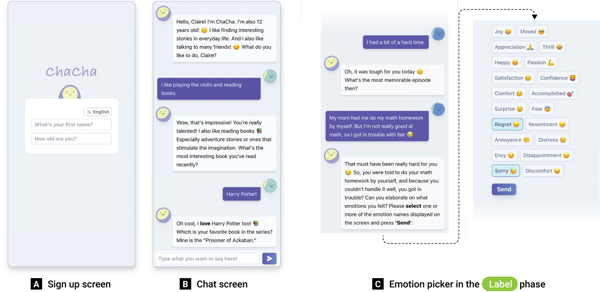

# ChaCha (CHAtbot for CHildren's emotion Awareness): LLM-Driven Chatbot for Enhancing Emotional Awareness in Children



This repository is a source code of the chatbot implementation presented in the ACM CHI 2024 paper, titled "**ChaCha: Leveraging Large Language Models to Prompt Children to Share Their Emotions about Personal Events**."

> Woosuk Seo, Chanmo Yang, and Young-Ho Kim. 2024.<br/>
> ChaCha: Leveraging Large Language Models to Prompt Children to Share Their Emotions about Personal Events.<br/>
> In Proceedings of ACM CHI Conference on Human Factors in Computing Systems (CHI'24). To appear.

## Project Website
https://naver-ai.github.io/chacha/

## System Requirements
1. Python 3.11.2 or higher
2. [Poetry](https://python-poetry.org/docs/) - Python project dependency manager
3. NodeJS and NPM - tested on 18.17.0
4. Paid OpenAI API key (ChaCha uses GPT-3.5 and GPT-4 models internally).

## How To Run
### Installation
1. In the root directory, install dependencies using `poetry`.
```shell
> poetry install
```

2. Install frontend Node dependencies
```shell
> cd frontend
> npm install
> cd ..
```

4. Run the setup script and follow the steps. It would help if you prepared the OpenAI API Key ready.
```shell
> poetry run python setup.py
```

### Testing Chatbot on Command Line
3. Run chat.py on the command line:
```shell
> poetry run python chat.py
```

### Testing Chatbot on Web

#### Running in development mode
1. **Run backend server**
    ```shell
    > poetry run python main.py
    ```
    The default port is 8000. You can set `--port` to designate manually.
    ```shell
    > poetry run python main.py --port 3000
    ```
2. **Run frontend server**
   
    The frontend is implemented with React in TypeScript. The development server is run on [Parcel](https://parceljs.org/).
    ```shell
    > cd frontend
    > npm install <-- Run this to install dependencies 
    > npm run dev
    ```
    Access http://localhost:8888 on web browser.

You can perform the above steps using a shell script:
```shell
> sh ./run-web-dev.sh
```


#### Running in production mode

The backend server can serve the frontend web under the hood via the same port.
To activate this, build the frontend code once:

```shell
> cd frontend
> npm run build
```

Then run the backend server:
```shell
> cd ..
> poetry run python main.py --production --port 80
```
Access http://localhost on web browser.

## Analysis of Chat Logs

### Chat Session Reviewing on Web
A session chat can be reviewed by visiting `[domain]/share/{session_id}`. There, you can also download the chat logs in CSV.

### Log Files
To keep the framework lightweight, ChaCha leverages a file storage instead of a database. The session information and chat messages are stored in `./data/sessions/{session_name}` in real time.

In the session directory, `info.json` maintains the metadata and the global configuration of the current session. For example:

```json
{
  "id": "User_001",
  "turns": 1,
  "response_generator": {
    "state_history": [
      [
        "explore",
        null
      ]
    ],
    "verbose": false,
    "payload_memory": {},
    "user_name": "John",
    "user_age": 12,
    "locale": "kr"
  }
}
```

In the same location, `dialogue.jsonl` keeps the list of chat messages in a format of [JsonLines](https://jsonlines.org/), where each message is formatted as a single-lined json object.


## Authors of the Code
* Young-Ho Kim (NAVER AI Lab) - Maintainer (yghokim@younghokim.net)
* Woosuk Seo (Intern at NAVER AI Lab, PhD candidate at University of Michigan)

## Acknowledgments
* This work was supported by NAVER AI
Lab through a research internship.
* The conversational flow design of ChaCha is grounded in Woosuk Seo’s dissertation research, which was supported by National Science Foundation CAREER Grant #1942547 (PI: Sun Young Park), advised by Sun
Young Park and Mark S. Ackerman, who are instrumental
in shaping this work.